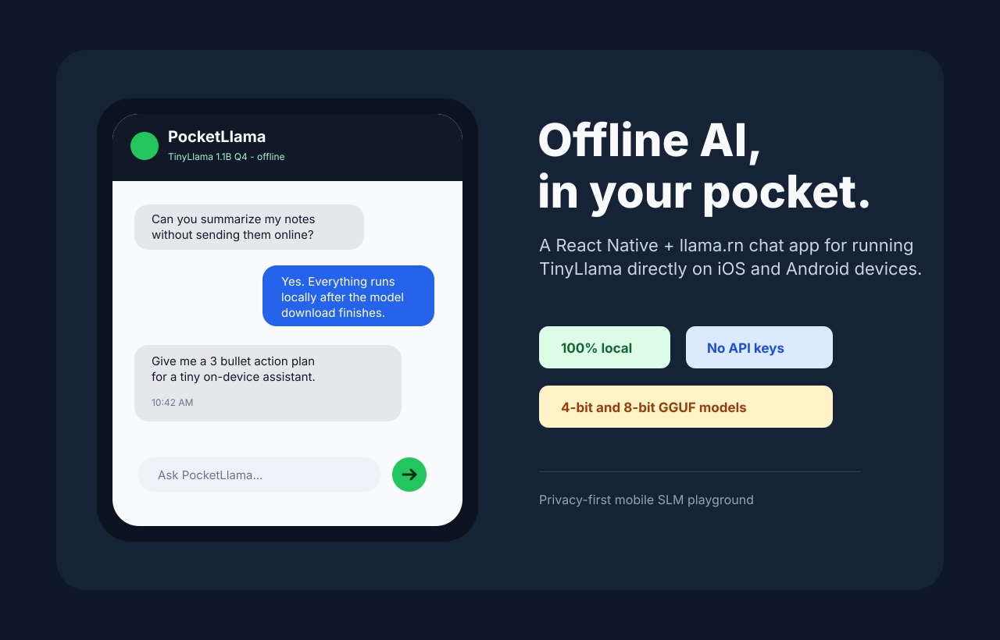
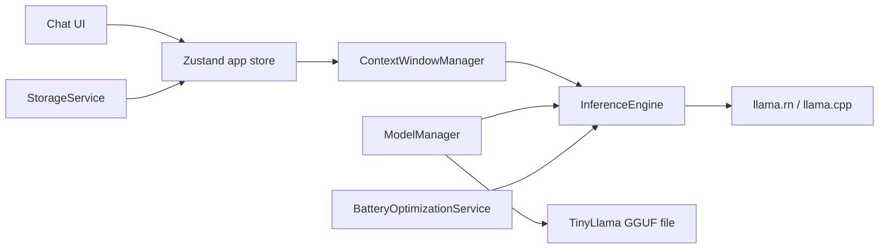

# PocketLlama

TinyLlama chat that runs on your phone, not someone else's server.



[](https://expo.dev)
[](https://reactnative.dev)
[](https://www.typescriptlang.org)
[](#how-it-works)

PocketLlama is a privacy-first mobile AI chat app built with Expo, React Native, and `llama.rn`. It downloads a quantized TinyLlama GGUF model once, then answers locally on iOS and Android with no cloud API calls, no usage meter, and no chat data leaving the device.

## Why It Is Cool

- Local-first chat with TinyLlama 1.1B through llama.cpp bindings.
- 4-bit and 8-bit model choices for older and newer phones.
- Battery-aware throttling for low-power situations.
- Sliding context window with lightweight semantic recall.
- SQLite-backed chat persistence with a web/mock mode for quick UI iteration.
- No API keys, no backend, no recurring inference cost.

## Quick Start

```bash
git clone https://github.com/ChiragArora31/PocketLlama.git
cd PocketLlama
npm install
npm run typecheck
npm run doctor
```

Run the app:

```bash
npm run ios
npm run android
npm run web
```

Native inference requires a development build because Expo Go cannot load `llama.rn`. Web is intentionally mock-only and is useful for UI checks.

## How It Works



The app detects device capability, recommends a quantization level, downloads the matching GGUF file, then initializes llama.cpp through `llama.rn`. Messages are persisted locally and recent context is combined with relevant archived messages before generation.

## Model Options

| Model | Size | Precision | Best For |
| --- | ---: | --- | --- |
| TinyLlama 1.1B Q4_K_M | 600 MB | 4-bit | Older devices, faster responses |
| TinyLlama 1.1B Q8_0 | 1.1 GB | 8-bit | Newer devices, better quality |

## Project Structure

```text
app/
  (tabs)/index.tsx                 Chat screen
  components/ChatBubble.tsx        Message bubbles
  constants/models.ts              GGUF model catalog
  services/InferenceEngine.ts      llama.rn generation wrapper
  services/ModelManager.ts         Download/load/unload lifecycle
  services/ContextWindowManager.ts Sliding context and recall
  services/BatteryOptimizationService.ts
  services/StorageService.ts       SQLite persistence
  store/appStore.ts                Zustand state
  utils/                           Device, logging, memory helpers
docs/screenshots/                  README visuals
```

## Verification

```bash
npm run typecheck
npm run doctor
npm audit
```

The dependency tree is kept on Expo SDK-compatible versions, with npm overrides for patched transitive build tooling where Expo's declared ranges lag behind security releases.

## Notes

PocketLlama is an educational on-device SLM project. TinyLlama is fast and small, but its quality is intentionally limited compared with larger cloud-hosted models. The product goal is privacy, portability, and a clean mobile inference pipeline.

## Credits

- [TinyLlama](https://github.com/jzhang38/TinyLlama)
- [llama.cpp](https://github.com/ggerganov/llama.cpp)
- [llama.rn](https://github.com/mybigday/llama.rn)
